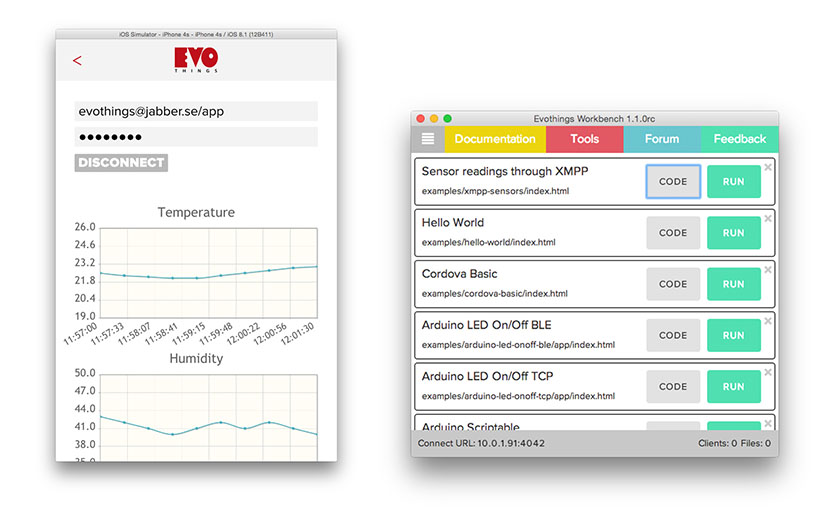
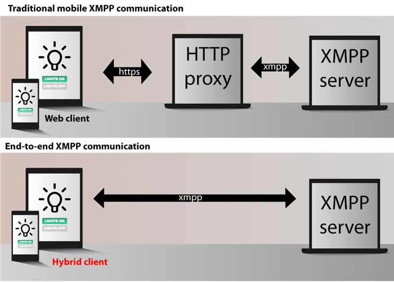

# How to develop a cross-platform mobile app that communicates directly with an XMPP-server

The easiest way to get started developing a mobile app that communicates using XMPP is to get Evothings Client from the [App Store](https://itunes.apple.com/app/evothings-client/id848974292?mt=8) or [Google Play](https://play.google.com/store/apps/details?id=com.evothings.evothingsclient&hl=en) and then use Evothings Workbench to load one of our [example apps](https://github.com/evothings/xmpp-hybrid-app-examples) onto your mobile device. This will all take only about 5 minutes. From there it’s simple to start developing your own app.

While you are developing your own app, it’s recommended to use Evothings Client because it contains the required plug-ins. These plug-ins include the [Chrome Apps Sockets TCP API](https://github.com/MobileChromeApps/mobile-chrome-apps/tree/master/chrome-cordova/plugins/chrome.sockets.tcp) needed for Strophe JS to communicate with the XMPP server through TCP sockets. The only thing you need to download is the modified Strophe JS library which can be found in [Evothings GitHub repository](https://github.com/Sionarch/xmpp-hybrid-app-examples/blob/master/basic/strophe.js), and [jQuery](http://jquery.com/download/).

Strophe JS was originally intended for enabling websites to communicate with an XMPP server through a separate proxy and the BOSH protocol. By utilizing natively implemented TCP sockets in iOS and Android, direct connections between the mobile device and server are possible. The modified version of Strophe JS together with the Chrome Apps Sockets TCP API Cordova plug-in allows you to write cross-platform apps for everything between chatting to sophisticated sensor monitoring and control.

Advanced users might want to check out Evothings [Strophe JS repository](https://github.com/evothings/strophejs/tree/chrome-socket) (chrome-socket branch). The [src/chromesocket.js](https://github.com/evothings/strophejs/blob/chrome-socket/src/chromesocket.js) file contains for example the bindings to the native TCP sockets plugin and handling of the retrieved XML data-stream.

## Step-by-step guide to making the mobile app

### Step 1
Get the Evothings Client development app from the [App Store](https://itunes.apple.com/app/evothings-client/id848974292?mt=8) or [Google Play](https://play.google.com/store/apps/details?id=com.evothings.evothingsclient&hl=en), or create your own Cordova app using the [Cordova command-line tools](https://github.com/apache/cordova-cli).

### Step 2
This step is needed only if you create your own Cordova app and involves adding the required plug-in “org.chromium.sockets.tcp” and its dependencies to your Cordova project. First download the Chrome Apps for Mobile toolchain, which can be done for example with Git using the following command:

		git clone https://github.com/MobileChromeApps/mobile-chrome-apps.git

Then add the required plugins to your project using e.g. the following commands:

		cordova plugin add ../mobile-chrome-apps/chrome-cordova/plugins/chrome.sockets.tcp
		
		cordova plugin add ../mobile-chrome-apps/chrome-cordova/plugins/chrome-common
		
		cordova plugin add ../mobile-chrome-apps/chrome-cordova/plugins/chrome.iosSocketsCommon

### Step 3
Download the modified Strophe JS library from [Evothings GitHub repository](https://github.com/Sionarch/xmpp-hybrid-app-examples/blob/master/basic/strophe.js), and the [jQuery library](http://jquery.com/download/). jQuery is used to simplify information retrieval from XMPP XML stanza’s.

### Step 4
Start coding! Include strophe.js in your app’s index.html file. The first thing you should do is to test the connection to an XMPP server. A connection to for example jabber.se can be initiated using the following code:

	document.addEventListener('deviceready', onDeviceReady, false)
	
	function onDeviceReady() {
	
		var connection = new Strophe.Connection('tcp://jabber.se')
	
		connection.connect('JID', 'password', function onConnect(status) {
		if (status == Strophe.Status.CONNECTED)
			alert('Connection successful!')
		});

	}

It’s important that the protocol specification “tcp://” is used because this tells Strophe.JS to use a native TCP socket that is needed for a direct server connection.

### Step 5
Set up handlers for chat messages, contacts presence and errors, and send an indication of your presence. This can be made with the following code which should be put inside the onConnect function:

	function on_chat_message(stanza) {
		alert('New chat message from: ' + $(stanza).attr('from'))
	}
	function on_presence(stanza) {
		alert('Presence from contact: ' + $(stanza).attr('from'))
	}

	function on_error_iq(stanza) {
		$(stanza).find('error').each(function() {
			alert('Info query error code: ' + $(this).attr('code'))
		})
	}

	connection.addHandler(on_chat_message, null, 'message', 'chat');
	connection.addHandler(on_presence, null, 'presence');
	connection.addHandler(on_error_iq, null, 'iq', 'error');

	connection.send($pres());

### Step 6
Play around and continue development! Check out the [Strophe JS documentation](http://strophe.im/strophejs/doc/1.1.3/files/strophe-js.html) to learn more about how to proceed with for example handling connection errors, how to respond to chat messages and so on. You’re also welcome to look at the code of our example apps to learn how they work.

Please let us know if you have any problems! You're welcome to discuss or ask questions about mobile apps that uses XMPP through [Evothings forum](http://evothings.com/forum/).
